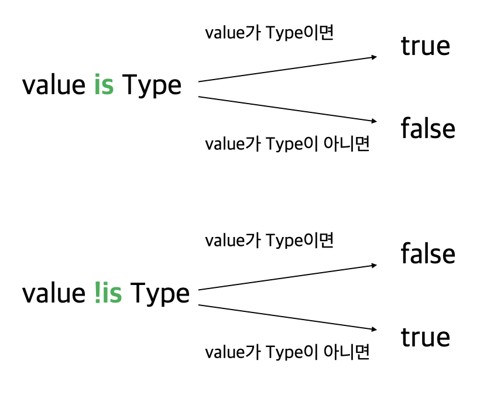

# [Section 1] 변수와 타입, 연산자를 다루는 방법

# ✅ 코틀린에서 `변수`를 다루는 방법

## 🔖 변수 선언 키워드 → `var`과 `val`의 차이점

### ✒️ 가변과 불변

```java
long number1 = 10L;
final long number2 = 10L;
```

```kotlin
var number1: Long = 10L; // 타입의 경우 명시적으로 작성되어 있지만 묵시적으로도 선언 가능
val number2: Long = 10L; 
```

**`var` → 가변 / `val` → 불변 (read-only)**

**초기값을 지정해주지 않는 경우에는 반드시 명시적 선언이 필요**

### ✒️ `val` 컬렉션

```java
final List<Integer> numbers = new ArrayList<>();
```

```kotlin
val numbers = ArrayList<Int>();
```

**Java의 컬렉션과 마찬가지로 element를 추가 가능**

기본적으로 모든 변수는 불변(`val`)으로 만들고 **꼭 필요한 경우 가변(`var`)으로 변경**

---

## 🔖 Kotlin에서의 Primitive Type

자바에서 `long`은 기본형 타입, `Long`은 참조형 타입이다.

Kotlin에서는 `Long`을 사용하면 연산시에 알아서 **참조형 타입 대신 기본형 타입을 사용**한다.

**코틀린 공식 문서 중..**

> 숫자, 문자, 불리언과 같은 몇몇 타입은 내부적으로 특별한 표현을 갖는다.
이 타입들은 실행시에 기본형 값으로 표현되지만, 코드에서는 평법한 클래스처럼 보인다.
> 

따라서 프로그래머가 `boxing/unboxing`을 고려하지 않아도 되도록 알아서 처리해줌

~~그니까 성능 문제 걱정 노노~~

---

## 🔖 Kotlin에서의 nullable 변수

```java
Optional<Long> number4 = null;
```

```kotlin
var number4: Long? = null
```

Kotlin에서 `null` 변수에 들어갈 수 있다면 **`[타입]?` 를 사용**하여 `nullable`을 표현할 수 있다.

---

## 🔖 Kotlin에서의 객체 인스턴스화

```java
Person person = new Person("양승민");
```

```kotlin
var person = Person("양승민")
```

Kotlin에서는 **`new`를 붙이지 않는다.**

---

# ✅ 코틀린에서 `null`을 다루는 방법

## 🔖 Kotlin에서의 null 체크

```java
 	  // Exception을 내거나
    public static boolean startsWithA1(String str) throws IllegalAccessException {
        if (str == null) {
            throw new IllegalAccessException("null이 들어왔습니다.");
        }
        return str.startsWith("A");
    }

    // null을 반환하거나
    public Boolean startsWithA2(String str) {
        if (str == null) {
            return null;
        }
        return str.startsWith("A");
    }

    // false를 반환하거나
    public boolean startsWithA3(String str) {
        if(str == null){
            return false;
        }
        return str.startsWith("A");
    }
```

```kotlin
    // Exception을 내거나
    fun startsWithA1(str: String?): Boolean {
        if (str == null) {
            throw IllegalAccessException("null이 들어왔습니다.")
        }
        return str.startsWith("A")
    }

    // null을 반환하거나
    fun startsWithA2(str: String?): Boolean? {
        if (str == null) {
            return null
        }
        return str.startsWith("A")
    }

    // false를 반환하거나
    fun startsWithA3(str: String?): Boolean {
        if (str == null) {
            return false
        }
        return str.startsWith("A")
    }
```

Kotlin에서는 위처럼 **`null`이 가능한 타입에 대한 취급**이 완전히 다르다.

---

## 🔖 Safe Call과 Elvis 연산자

Kotlin에는 **`null`이 가능한 타입만을 위한 기능**이 있다.

```kotlin
    val str: String? = "ABC"

    // Safe Call
    str.length  // 불가능
    str?.length // 가능

    // Elvis 연산자
    str?.length ?: 0
```

- **Safe Call** → `null`이 아니면 실행하고, `null`이면 실행하지 않는다. 
(그대로 null)
- **Elvis 연산자** → 앞의 연산 결과가 `null`이면 뒤의 값을 사용한다.

**지금까지 작성했던 함수에 Safe Call과 Elvis 연산자를 적용시키면?**

```kotlin
    fun startsWithA1V2(str: String?): Boolean {
        return str?.startsWith("A")
            ?: throw IllegalAccessException("null이 들어왔습니다.")
    }

    fun startsWithA2V2(str: String?): Boolean? {
        return str?.startsWith("A")
    }

    fun startsWithA3V2(str: String?): Boolean {
        return str?.startsWith("A") ?: false
    }
```

**Elvis 연산자는 early return에도 사용할 수 있다.**

```java
    // early return
    public long calculate(Long number) {
        if (number == 0) {
            return 0;
        }
        // 다음 로직
    }
```

```kotlin
    // early return
    fun calculate(number: Long?): Long {
        number ?: return 0
        //다음 로직
    }
```

nullable type이지만, 아무리 생각해도 `null`이 될 수 없는 경우

`!!` 연산자로 단언할 수 있다.

```kotlin
    // null 아님 단언
    fun startsWithA4(str: String?): Boolean {
        return str!!.startsWith("A")
    }
```

---

## 🔖 플랫폼 타입

```java
public class Person {
    private final String name;

    public Person(String name) {
        this.name = name;
    }

    @Nullable
    public String getName() {
        return name;
    }

}
```

다음과 같은 코드에 `@Nullable`이 없다면 Kotlin에서는 이 값이 nullable인지 non-nullable인지 알 수가 없다.

따라서 `null` 관련 정보를 알 수 없는 타입을 **플랫폼 타입**이라고 하며 
**Runtime시 Exception이 날 수 있다.**

그래서 자바코드를 Kotlin에 가져다 쓸 때는 항상 `null`처리를 조심하자.

---

# ✅ 코틀린에서 `Type`을 다루는 방법

## 🔖 기본 타입

Kotlin에서는 선언된 기본값을 보고 타입을 추론한다.

```kotlin
    val number1 = 3     // Int
    val number2 = 3L    // Long

    val number3 = 3.0f  // Float
    val number4 = 3.0   // Double
```

자바에서 기본 타입간의 변환은 암시적으로 이루어질 수 있다.

하지만 **Kotlin에서는 기본 타입간의 변환이 명시적으로 이루어져야 한다.**

```java
    int numberInt = 4;
    long numberLong = numberInt;
```

```kotlin
    val numberInt = 4
    val numberLong = numberInt.toLong()
    
    // 추가 예시
    val numberInt2 = 3
    val numberInt3 = 5
    val result = numberInt2 / numberInt3.toDouble()
```

---

## 🔖 타입 캐스팅

기본 타입이 아닌 일반 타입의 경우는 어떻게 해야할까?

```java
    public static void printAgeIfPerson(Object object) {
        if(object instanceof Person){
            Person person = (Person) object;
            System.out.println(person.getAge());
        }
    }
```

자바의 경우에는 변수가 주어진 타입이면 `true`, 그렇지 않으면 `false`를 반환하는 **`instanceof` 연산자를 사용**하여 변수가 주어진 타입인지 확인한다.

또한, `(타입)` 형태로 주어진 변수를 해당 타입으로 캐스팅한다.

```kotlin
    fun printAgeIfPerson(obj: Any) {
        if(obj is Person) {
            val person = obj as Person
            println(person.age)
        }
    }

    // 개선
    fun printAgeIfPersonForSmart(obj: Any) {
        if(obj is Person) {
            println(obj.age)
        }
    }
```

Kotlin의 경우 자바의 `instanceof` 연산자와 같이 **`is` 연산자**를 이용하는 것을 확인할 수 있다.

또한, `as [타입]`의 형태로 캐스팅하는 것을 확인할 수 있다.

개선된 부분과 같이 **스마트 캐스팅**도 가능하다.




---

## 🔖 Kotlin의 특이한 타입 3가지

### ✒️ Any

> **자바에서의 `Object` → 모든 객체의 최상위 타입 → 코틀린에서의 `Any`**
> 
- 모든 기본형 타입의 최상의 타입도 `Any`이다.
- `Any` 자체로는 `null`을 포함할 수 없어 `null`을 포함하고 싶다면, `Any?`로 표현한다.
- `Any`에 `equals` / `hashCode` / `toString` 이 존재한다.

### ✒️ Unit

> **자바에서의 `void`와 동일한 역할**
> 
- `void`와 다르게 `Unit`은 그 자체로 타입 인자로 사용이 가능하다.
- 함수형 프로그래밍에서 `Unit`은 단 하나의 인스턴스만 갖는 타입을 의미한다.
→ 즉, 코틀린의 `Unit`은 실제 존재하는 타입이라는 것을 표현

### ✒️ Nothing

> **함수가 정상적으로 끝나지 않았다는 사실을 표현하는 역할이다.**
(예: 무조건 예외를 반환하는 함수 / 무한 루프 함수 등)
> 

### ✒️ String Interpolation / String Indexing

```java
    Person person = new Person("양승민", 100);
    String log = String.format("사람의 이름은 %s이고 나이는 %s세 입니다", person.getName(), person.getAge());
```

```kotlin
    val person = Person("양승민", 100)
    val log = "사람의 이름은 ${person.name}이고 나이는 ${person.age}세 입니다"
```

**위처럼 `${변수}`를 사용하면 값이 들어간다.**

`Indexing`의 경우는 다음처럼 사용할 수 있다.

```java
    String str = "ABCDE";
    char ch = str.charAt(1);
```

```kotlin
    val str = "ABCDE"
    val ch = str[1]
```

위처럼 배열을 불러오듯이 사용이 가능하다.

---

# ✅ 코틀린에서 `연산자`을 다루는 방법

## 🔖 단항 연산자 / 산술 연산자

Java, Kotlin 완전 동일함

## 🔖 비교 연산자와 동등성, 동일성

### ✒️ 비교 연산자

Java, Kotlin이 사용하는 연산자는 동일하지만 Java와 다르게 객체를 비교할때 비교 연산자 사용시 자동으로 `compareTo`를 호출해준다.

### ✒️ 동등성과 동일성

**동등성(Equality)** → 두 객체의 값이 같은지

**동일성(Identity)** → 두 객체가 완전 동일한 인스턴스인지

```java
        Integer a = 5;
        Integer b = 5;

        if (a == b) {
            System.out.println("동일성 비교");
        } else if (a.equals(b)) {
            System.out.println("동등성 비교");
        }
```

```kotlin
    val a = 5;
    val b = 5;

    if (a === b) {
        println("동일성 비교")
    } else if (a == b) {
        println("동등성 비교")
    }
```

Java의 경우 동등성에 `equals()`, 동일성에 `==`을 사용하지만,
Kotlin의 경우 동등성에 `==`, 동일성에 `===`을 사용한다. (`==`을 사용하면 간접적으로 `equals`를 호출해준다.)

## 🔖 논리 연산자와 코틀린에만 있는 특이한 연산자

### ✒️ 논리 연산자

논리 연산자 역시 Java, Kotlin 완전 동일하다.

### ✒️ in 연산자

> 컬렉션이나 **범위에 포함되어 있는지 없는지**를 의미
> 

```kotlin
    val str = "ABCDE"
    if ('B' in str) {
        println("str 안에 B 있음")
    }
    if ('H' !in str) {
        println("str 안에 H 없음")
    }
```

## 🔖 연산자 오버로딩

```java
package lec04;

import org.jetbrains.annotations.NotNull;

public class JavaMoney implements Comparable<JavaMoney>{
    private final long amount;

    public JavaMoney(long amount) {
        this.amount = amount;
    }

    public JavaMoney plus(JavaMoney other) {
        return new JavaMoney(this.amount + other.amount);
    }

    @Override
    public int compareTo(@NotNull JavaMoney o) {
        return Long.compare(this.amount, o.amount);
    }
}
```

```java
        JavaMoney money1 = new JavaMoney(1_000L);
        JavaMoney money2 = new JavaMoney(2_000L);
        System.out.println(money1.plus(money2));
```

```kotlin
package lec04

data class Money(
    val amount: Long
){

    operator fun plus(other: Money) : Money{
        return Money(this.amount + other.amount)
    }
}
```

```kotlin
    val money1 = Money(1_000L)
    val money2 = Money(2_000L)
    println(money1 + money2)
```

위처럼 객체마다 **연산자를 직접 정의**해 줄 수 있다.

---