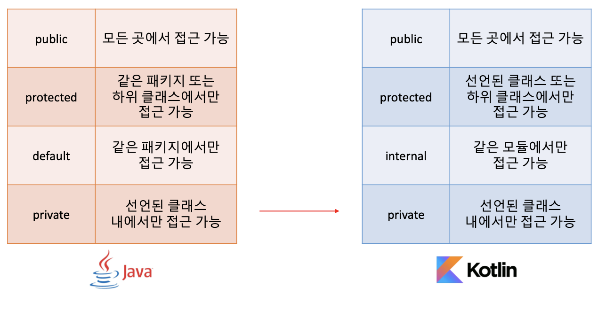

# [Section 3] OOP

# ✅ 코틀린에서 `클래스`를 다루는 방법

## 🔖 클래스와 프로퍼티

개명이 불가능한 나라에 사는 Person 클래스를 작성해보자.

```java
public class JavaPerson {

    private final String name;
    private int age;

    public JavaPerson(String name, int age) {
        this.name = name;
        this.age = age;
    }

    public String getName() {
        return name;
    }

    public int getAge() {
        return age;
    }

    public void setAge(int age) {
        this.age = age;
    }
}
```

```kotlin
class Person(
    val name: String,
    var age: Int
)
```

위처럼 `생성자`와 `getter`, `setter`를 생성해 주지 않아도 자동으로 생성된다.
(마치 자바의 `record` 처럼)

```kotlin
    val person = Person("양승민", 100)
    println(person.name)
    person.age = 10

    println(person.age)

    val javaPerson = Person("양승민", 100)
    println(javaPerson.name)
    javaPerson.age = 10

    println(javaPerson.age)
```

`.필드`로 호출할 수 있다. 자바클래스로 만들어진 클래스를 호출할때도 마찬가지이다.

---

## 🔖 생성자와 init

클래스가 생성되는 시점에 나이를 검증해보자.

```java
    // 자바는 생성자에서 검증
    public JavaPerson(String name, int age) {
        if (age < 0) {
            throw new IllegalArgumentException(String.format("나이(%s)가 이상함", age));
        }
        this.name = name;
        this.age = age;
    }
```

```kotlin
class Person(
    val name: String,
    var age: Int
){

    // init 블럭을 클래스 내부에 만들어 생성시 검증이 가능
    init{
        if (age < 0) {
            throw IllegalArgumentException("나이(${age})가 이상함")
        }
    }
}
```

최초로 태어나는 아기는 무조건 1살일테니까 생성자를 하나 더 만들어보자

```java
    public JavaPerson(String name) {
        this(name, 1);
    }

    public JavaPerson() {
        this("양승민");
    }
```

```kotlin
class Person(
    val name: String,
    var age: Int
){

    init{
        if (age < 0) {
            throw IllegalArgumentException("나이(${age})가 이상함")
        }
    }

		// constructor를 클래스 내부에 넣어서 부생성자를 만들 수 있다.
    constructor(name: String) : this(name, 1){
        println("부생성자 1")
    }

    constructor() : this("양승민") {
        println("부생성자 2")
    }
}
```

위와 같은 방식은 근데 비추 → 본문 실행 방식이 헷갈릴 수 있기 때문

그래서 위 방식 보다는 **`default prameter`를 사용하는 방법을 권장**한다.

```kotlin
class Person(
    val name: String = "양승민",
    var age: Int = 1
)
```

`Converting`의 경우 부생성자를 사용할 수 있지만, 이 역시 부생성자 보다는 **정적 팩토리 메서드**를 추천한다고함

---

## 🔖 커스텀 getter, setter

성인인지 확인하는 기능을 추가해보자.

```java
    public boolean isAdult() {
        return this.age >= 20;
    }
```

```kotlin
    fun isAdultV1(): Boolean {
        return this.age >= 20
    }
		
		// custom getter의 사용
    val isAdultV2: Boolean
        get() = this.age >= 20

    val isAdultV3: Boolean
        get() {
            return this.age >= 20
        }
```

위 모두 동일한 기능이고 표현 방법만 다르다.

`커스텀 getter`를 사용하면 자기 자신을 변형해 줄 수도 있다.
`name`을 `get`할 때 무조건 대문자로 바꾸어 보자.

```kotlin
class Person(
    name: String = "양승민",
    var age: Int = 1
) {
		// 커스텀 getter를 사용한 변형
		// 이 때 field는 무한루프를 막기 위한 backing field
    val name: String = name
        get() = field.uppercase()
}
```

이번엔 `name`을 `set`할 때 무조건 대문자로 바꾸어 보자.

```kotlin
    var name: String = name
        get() = field.uppercase()
        // 커스텀 setter를 사용한 초기화
        set(value){
            field = value.uppercase()
        }
```

근데 둘 다 잘 안쓰는듯…

---

# ✅ 코틀린에서 `상속`을 다루는 방법

## 🔖 추상 클래스

`Animal`이라는 추상클래스를 구현한 `Cat`, `Penguin` 클래스를 만들어보자.

```java
public abstract class JavaAnimal {

    protected final String species;
    protected final int legCount;

    public JavaAnimal(String species, int legCount) {
        this.species = species;
        this.legCount = legCount;
    }

    abstract public void move();

    public String getSpecies() {
        return species;
    }

    public int getLegCount() {
        return legCount;
    }
}
```

```kotlin
abstract class Animal(
    protected val species: String,
    protected open val legCount: Int // 추상 프로퍼티가 아니면, 상속받을 때 open을 꼭 붙여야 한다.
) {
    abstract fun move()
}
```

```java
public class JavaCat extends JavaAnimal {
    public JavaCat(String species, int legCount) {
        super(species, 4);
    }

    @Override
    public void move() {
        System.out.println("꽁꽁 얼어붙은 한강 위에 고양이가 어쩌구");
    }
}
```

```kotlin
class Cat(
    species: String
) : Animal(species, 4) {
    override fun move() {
        println("꽁꽁 얼어붙은 한강 위에 고양이가 어쩌구")
    }
}
```

```java
public class JavaPenguin extends JavaAnimal{

    private final int wingCount;

    public JavaPenguin(String species, int legCount) {
        super(species, 2);
        this.wingCount = 2;
    }

    @Override
    public void move() {
        System.out.println("가자 펭귄");
    }

    @Override
    public int getLegCount() {
        return super.getLegCount() + this.wingCount;
    }
}
```

```kotlin
class Penguin(
    species: String,
) : Animal(species, 2) {

    private val wingCount = 2
    override fun move() {
        println("가자 펭귄")
    }

    override val legCount
        get() = super.legCount + this.wingCount
}
```

자바, 코틀린 모두 **추상 클래스는 인스턴스화 할 수 없다.**

---

## 🔖 인터페이스

`Flyable`과 `Swimmable`을 구현한 `Penguin`을 만들어 보자.

```java
public interface JavaSwimable {
    default void act() {
        System.out.println("어푸 어푸");
    }
}
```

```java
public interface JavaFlyable {
    default void act() {
        System.out.println("파닥 파닥");
    }
}
```

```kotlin
interface Swimable {
    fun act(){
        println("어푸 어푸")
    }
}
```

```kotlin
interface Flyable {
    fun act(){
        println("파닥 파닥")
    }
}
```

위처럼 `default` 키워드 없이 구현 가능하다.

인터페이스 구현 시에는 다음과 같다.

```java
public class JavaPenguin extends JavaAnimal implements JavaSwimable, JavaFlyable{

    private final int wingCount;

    public JavaPenguin(String species, int legCount) {
        super(species, 2);
        this.wingCount = 2;
    }

    @Override
    public void move() {
        System.out.println("가자 펭귄");
    }

    @Override
    public int getLegCount() {
        return super.getLegCount() + this.wingCount;
    }

    @Override
    public void act() {
        JavaSwimable.super.act();
        JavaFlyable.super.act();
    }
}
```

```kotlin
class Penguin(
    species: String,
) : Animal(species, 2), Swimable, Flyable {

    private val wingCount = 2
    override fun move() {
        println("가자 펭귄")
    }

    override val legCount
        get() = super.legCount + this.wingCount

    override fun act() {
        super<Swimable>.act()
        super<Flyable>.act()
    }
}
```

중복되는 **인터페이스를 특정할 때 `super<타입>.함수`를 사용**한다.

자바와 코틀린 모두 인터페이스를 인스턴스화할 수 없다.

코틀린에서는 `backing field`가 없는 프로퍼티를 인터페이스에 만들 수 있다.

---

## 🔖 클래스를 상속할 때 주의할 점

**상위 클래스를 설계할 때 생성자 또는 초기화 블록에 사용되는 프로퍼티에는 `open`을 피해야 한다.**

---

## 🔖 상속 관련 지시어 정리

### final

> `override`를 할 수 없게 한다. `default`로 보이지 않게 존재한다.
> 

### open

> `override`를 열어 준다.
> 

### abstract

> 반드시 `override` 해야 한다.
> 

### override

> 상위 타입을 오버라이드 하고 있다.
> 

---

# ✅ 코틀린에서 `접근 제어`를 다루는 방법

## 🔖 자바와 코틀린의 가시성 제어



코틀린에서는 패키지를 `namespace`를 관리하기 위한 용도로만 사용한다.
가시성 제어에는 사용되지 않는다.

자바의 기본 접근 지시어는 `default`
코틀린의 기본 접근 지시어는 `public` 이다.

---

## 🔖 코틀린 파일의 접근 제어

코틀린은 **`.kt` 파일에 변수, 함수, 클래스**를 다양하게 바로 만들 수 있다.


Kotlin의 파일 접근 제어

---

## 🔖 다양한 구성요소의 접근 제어

### ✒️ 클래스

클래스에서의 접근 제어도 가시성 범위가 동일하다.

### ✒️ 생성자

생성자의 경우 접근 지시어를 붙이려면, `constructor`를 써주어야 한다.

자바에서 유틸성 코드를 만들 때 `abstract class` + `private constructor`를 사용해서 인스턴스화를 막았다. (상수를 사용할 때 라던가)

코틀린에서도 비슷하게 가능하지만, 그보다 **파일 최상단에 바로 유틸 함수를 작성**하면 편하다.

### ✒️ 프로퍼티

프로퍼티도 가시성 범위는 동일하다. 가시성을 제어하는 방법으로는

```kotlin
class Car(
    internal val name: String,
    _price: Int
) {
    var price = _price
    private set
}
```

위처럼 `getter`, `setter` 한 번에 접근 지시어를 정하거나
`setter`에만 추가로 가시성을 부여할 수 있다.

---

## 🔖 자바와 코틀린을 함께 사용할 경우 주의할 점

> `internal`은 바이트 코드상 `public`이 된다. 따라서 자바 코드에서는 코틀린 모듈의 `internal` 코드를 가져올 수 있다.

코틀린의 `protected`와 자바의 `protected`는 다르다.
자바는 같은 패키지의 코틀린 `protected` 멤버에 접근할 수 있다.
> 

---

# ✅ 코틀린에서 `object`를 다루는 방법

## 🔖 static 함수와 변수

또 사람 예제 한번 보자. 새로운 아기는 항상 나이가 1이라고 할 때,

```java
public class JavaPerson {
    private static final int MIN_AGE = 1;

    public static JavaPerson newBaby(String name) {
        return new JavaPerson(name, MIN_AGE);
    }

    private String name;
    private int age;

    private JavaPerson(String name, int age) {
        this.name = name;
        this.age = age;
    }
}
```

```kotlin
class Person private constructor(
    private val name:String,
    private val age:Int,
) {
		// static 대신에 companion object를 사용
    companion object{
        private val MIN_AGE = 0
        fun newBaby(name: String) = Person(name, MIN_AGE)
    }
}
```

### ✒️ static

> 클래스가 인스턴스화 될 때 새로운 값이 복제되는게 아니라 정적으로 인스턴스끼리의 값을 공유
> 

### ✒️ companion object

> 클래스와 **동행**하는 유일한 오브젝트
> 

```kotlin
// 런타임 시에 변수가 할당
private val MIN_AGE = 0
// 컴파일 시에 변수가 할당
private constval MIN_AGE = 0
```

진짜 상수에 붙이기 위한 용도이다. 기본타입과 `String`에 붙일 수 있다.

```kotlin
    companion object Factory : Log{
        private val MIN_AGE = 0
        fun newBaby(name: String) = Person(name, MIN_AGE)
    }
```

이처럼 이름을 붙여주거나 인터페이스를 구현할 수도 있다.

하지만 **유틸성 함수들은 최상단 파일을 활용하는 것을 권장**한다.

자바에서는 코틀린 코드에 `@JvmStatic` 을 붙여야 사용할 수 있다.

```kotlin
    companion object Factory : Log{
        private val MIN_AGE = 0
        
        @JvmStatic
        fun newBaby(name: String) = Person(name, MIN_AGE)
    }
```

---

## 🔖 싱글톤

```java
public class JavaSingleton {

    private static final JavaSingleton INSTANCE = new JavaSingleton();

    private JavaSingleton() {}

    public static JavaSingleton getInstance() {
        return INSTANCE;
    }
}
```

```kotlin
object Singleton
```

이게 끝? 진짜 레전드다;;

---

## 🔖 익명 클래스

> 특정 인터페이스나 클래스를 상속받은 구현체를 일회성으로 사용할 때 쓰는 클래스
> 

```java
    public static void main(String[] args) {
        moveSomething(new Movable() {

            @Override
            public void move() {
                System.out.println("움직움직");
            }

            @Override
            public void fly() {
                System.out.println("날앙");
            }
        });
    }

    private static void moveSomething(Movable movable) {
        movable.fly();
        movable.move();
    }
```

```kotlin
fun main() {
    moveSomething(object : Movable {
        override fun move() {
            println("움직움직")
        }

        override fun fly() {
            println("날앙")
        }
    })
}

private fun moveSomething(movable: Movable) {
    movable.move()
    movable.fly()
}
```

자바에서는 `new 타입이름()`, 코틀린에서는 `object : 타입이름`

---

# ✅ 코틀린에서 `중첩 클래스`를 다루는 방법

## 🔖 중첩 클래스의 종류

### 클래스 안에 클래스를 만들 때는 `static` 클래스를 사용하라

```java
public class JavaHouse {

    private String address;
    private LivingRoom livingRoom;

    public JavaHouse(String address, LivingRoom livingRoom) {
        this.address = address;
        this.livingRoom = new LivingRoom(10);
    }

    public LivingRoom getLivingRoom() {
        return livingRoom;
    }

    public static class LivingRoom {
        private double area;

        public LivingRoom(double area) {
            this.area = area;
        }
        // 바깥 클래스를 불러올 수 없음
//        public String getAddress() {
//            return JavaHouse.this.LivingRoom;
//        }
    }
}
```

```kotlin
class House(
    var address:String,
    var livingRoom: LivingRoom = LivingRoom(10.0)
) {

    class LivingRoom(
        private var area: Double,
    )
}
```

코틀린 `inner class`에서 바깥 클래스를 참조하려면 `this@바깥클래스`를 사용하면 되긴하지만 권장되는 방법은 아니다.

사용할 때 찾아보자.

---

# ✅ 코틀린에서 `다양한 클래스`를 다루는 방법

## 🔖 Data Class

```java
public class JavaPersonDto {

    private final String name;
    private final int age;

    public JavaPersonDto(String name, int age) {
        this.name = name;
        this.age = age;
    }
}
```

```kotlin
data class PersonDto(
    private val name: String,
    private val age: Int
)
```

자바 레코드가 코틀린의 `Data Class`를 보고 만든 듯

---

## 🔖 Enum Class

```java
public enum JavaCountry {

    KOREA("KO"),
    AMERICA("US");

    private final String code;

    JavaCountry(String code) {
        this.code = code;
    }

    public String getCode() {
        return code;
    }
}
```

```kotlin
enum class Country(
    val code: String,
) {
    KOREA("KO"),
    AMERICA("US")
}
```

비슷함.

```java
    private static void handleCountry(JavaCountry country) {
        if (country == JavaCountry.KOREA) {
            // 로직
        }

        if (country == JavaCountry.AMERICA) {
            // 로직
        }
    }
```

```kotlin
    private fun handleCountry(country: Country) {
        when (country) {
            KOREA -> TODO()
            AMERICA -> TODO()
        }
    }
```

자바의 `enum`에서는 `else` 로직 처리가 좀 애매해지는데 **코틀린에서는 `when`을 활용하면 간단하게 처리 가능**하다.

---

## 🔖 Sealed Class, Sealed Interface

> 봉인된 클래스라고 불리는데, 컴파일 타임 때 하위 클래스의 타입을 모두 기억한다. 즉, 런타임 때 클래스 타입이 추가될 수 없다.

하위 클래스는 같은 패키지 안에 있어야 한다.

`Enum`과 비슷하긴 한데 다른 점은 클래스를 상속받을 수 있고, 하위 클래스는 멀티 인스턴스가 가능하다.
> 

```kotlin
sealed class HyundaiCar(
    val name: String,
    val price: Long
) {

    class Avante : HyundaiCar("아반떼", 1_000L)

    class Sonata : HyundaiCar("소나타", 2_000L)

    class Grandeur : HyundaiCar("그렌저", 3_000L)

}
```

컴파일 타임 때 하위 클래스의 타입을 모두 기억한다.
즉, **런타임 때 클래스 타입이 추가될 수 없다.**

보통 추상화가 필요한 `Entity`나 `DTO`에 `sealed class`를 활용한다.

```kotlin
fun main() {
    handleCar(HyundaiCar.Avante())
}

private fun handleCar(car: HyundaiCar) {
    when (car) {
        is HyundaiCar.Avante -> TODO()
        is HyundaiCar.Sonata -> TODO()
        is HyundaiCar.Grandeur -> TODO()
    }
}
```

JDK17에서도 `Sealed Class`가 추가됨

---